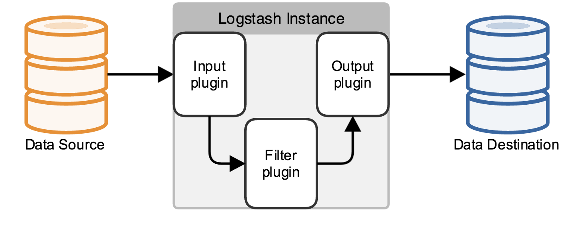

<!-- $size: 16:9 -->

Logstash Grok patterns
===

#### 

##### Logstash Grok patterns for Softnix Log Query
https://github.com/pobsuwan/grok-training

###### Created by [Apiwat Suksuwan](https://github.com/pobsuwan/logstash-conf)
###### Software Engineer at softnix technology co. Ltd

---

# Logstash::Intro()
###### 
- Logstash [Documents](https://www.elastic.co/guide/en/logstash/current/index.html)
- Logstash has [INPUT](https://www.elastic.co/guide/en/logstash/current/input-plugins.html) / [FILTER](https://www.elastic.co/guide/en/logstash/current/filter-plugins.html) / [OUTPUT](https://www.elastic.co/guide/en/logstash/current/output-plugins.html)

---

# Logstash::Plugin()
###### Input plugin
- [TCP](https://www.elastic.co/guide/en/logstash/current/plugins-inputs-tcp.html) / [UDP](https://www.elastic.co/guide/en/logstash/current/plugins-inputs-udp.html)
	- > tcp { port => 5140 codec => json }
		udp { port => 5140 codec => json }
- [Syslog](https://www.elastic.co/guide/en/logstash/current/plugins-inputs-syslog.html)
	- > syslog { port => 5140 }
- [File](https://www.elastic.co/guide/en/logstash/current/plugins-inputs-file.html)
	- > file { path => ["/tmp/file.log"] }
- [Kafka](https://www.elastic.co/guide/en/logstash/current/plugins-inputs-kafka.html)
	- > kafka { zk_connect => "127.0.0.1:2181" topic_id => "rawlogs" }

---

# Logstash::Plugin()
###### Filter plugin
- [Grok](https://www.elastic.co/guide/en/logstash/current/plugins-filters-grok.html)
	- [Grok Debugger](https://grokdebug.herokuapp.com/)
	- [Grok Constructor](http://grokconstructor.appspot.com/)
- [CSV](https://www.elastic.co/guide/en/logstash/current/plugins-filters-csv.html)
- [Mutate](https://www.elastic.co/guide/en/logstash/current/plugins-filters-mutate.html) rename, remove, replace, and modify fields
- [Date](https://www.elastic.co/guide/en/logstash/current/plugins-filters-date.html) convert data to date format

---

# Logstash::Plugin()
###### Output plugin
- [Elasticsearch](https://www.elastic.co/guide/en/logstash/current/plugins-outputs-elasticsearch.html)
	- > elasticsearch { hosts => [ "127.0.0.1" ] }
- [File](https://www.elastic.co/guide/en/logstash/current/plugins-outputs-file.html)
 	- > file { path => ["/tmp/file.log"] }
- [Stdout](https://www.elastic.co/guide/en/logstash/current/plugins-outputs-stdout.html)
	- > stdout { codec => rubydebug { metadata => true } }

---

# Let's start 
## Basic


---

# Logstash::Grok()->input
/root/apache.log
```
83.149.9.216 - - [04/Jan/2015:05:13:42 +0000] "GET /presentations/logstash-monitorama-2013/images/kibana-search.png HTTP/1.1" 200 203023 "http://semicomplete.com/presentations/logstash-monitorama-2013/" "Mozilla/5.0 (Macintosh; Intel Mac OS X 10_9_1) AppleWebKit/537.36 (KHTML, like Gecko) Chrome/32.0.1700.77 Safari/537.36"
```
/root/sample.conf
```
input {
    file {
        path => "/root/apache.log"
        start_position => "beginning"
        sincedb_path => "/dev/null"
    }
}
```

---
# Logstash::Grok()->filter
```
filter { }
```
# Logstash::Grok()->output
```
output {
    stdout {
        codec => rubydebug {
            metadata => true
        }
    }
}
```

---
# Logstash::Run()
##### Test config
```
/opt/logstash/bin/logstash -f /root/sample.conf --configtest
```

##### Run
```
/opt/logstash/bin/logstash -f /root/sample.conf
```

---
# Logstash::Grok()->print()->Output
```
{
       "message" => "83.149.9.216 - - [04/Jan/2015:05:13:42 +0000] \"GET /presentations/logstash-monitorama-2013/images/kibana-search.png HTTP/1.1\" 200 203023 \"http://semicomplete.com/presentations/logstash-monitorama-2013/\" \"Mozilla/5.0 (Macintosh; Intel Mac OS X 10_9_1) AppleWebKit/537.36 (KHTML, like Gecko) Chrome/32.0.1700.77 Safari/537.36\"",
      "@version" => "1",
    "@timestamp" => "2016-09-07T09:37:38.640Z",
          "path" => "/root/apache.log",
          "host" => "0.0.0.0",
     "@metadata" => {
        "path" => "/root/apache.log"
    }
}
```

---

# Logstash::Grok()->addFilter
```
filter {
    grok {
    	match => { "message" => "%{IPORHOST:clientip} %{USER:ident} %{USER:auth} \[%{HTTPDATE:timestamp}\] \"(?:%{WORD:verb} %{NOTSPACE:request}(?: HTTP/%{NUMBER:httpversion})?|%{DATA:rawrequest})\" %{NUMBER:response} (?:%{NUMBER:bytes}|-) %{QS:referrer} %{QS:agent}"}
    }
}
```
##### Test && Run
```
/opt/logstash/bin/logstash -f /root/sample.conf -t
/opt/logstash/bin/logstash -f /root/sample.conf
```

---
# Logstash::Grok()->print()->Output
```
{
        "message" => "83.149.9.216 - - [04/Jan/2015:05:13:42 +0000] \"GET /presentations/logstash-monitorama-2013/images/kibana-search.png HTTP/1.1\" 200 203023 \"http://semicomplete.com/presentations/logstash-monitorama-2013/\" \"Mozilla/5.0 (Macintosh; Intel Mac OS X 10_9_1) AppleWebKit/537.36 (KHTML, like Gecko) Chrome/32.0.1700.77 Safari/537.36\"",
       "@version" => "1",
     "@timestamp" => "2016-09-07T09:41:05.479Z",
           "path" => "/root/apache.log",
           "host" => "0.0.0.0",
       "clientip" => "83.149.9.216",
          "ident" => "-",
           "auth" => "-",
      "timestamp" => "04/Jan/2015:05:13:42 +0000",
           "verb" => "GET",
        "request" => "/presentations/logstash-monitorama-2013/images/kibana-search.png",
    "httpversion" => "1.1",
       "response" => "200",
          "bytes" => "203023",
       "referrer" => "\"http://semicomplete.com/presentations/logstash-monitorama-2013/\"",
          "agent" => "\"Mozilla/5.0 (Macintosh; Intel Mac OS X 10_9_1) AppleWebKit/537.36 (KHTML, like Gecko) Chrome/32.0.1700.77 Safari/537.36\"",
      "@metadata" => {
        "path" => "/root/apache.log"
    }
}
```

---
# Logstash::Patterns()
```
filter {
    grok {
        match => { "message" => "%{COMBINEDAPACHELOG}"}
    }
}
```
###### Apache pattern is definded
```
COMMONAPACHELOG %{IPORHOST:clientip} %{USER:ident} %{USER:auth} \[%{HTTPDATE:timestamp}\] "(?:%{WORD:verb} %{NOTSPACE:request}(?: HTTP/%{NUMBER:httpversion})?|%{DATA:rawrequest})" %{NUMBER:response} (?:%{NUMBER:bytes}|-)
COMBINEDAPACHELOG %{COMMONAPACHELOG} %{QS:referrer} %{QS:agent}
```
---
# End Logstash Basic


---
# Q&A

---
# Logstash Grok patterns for Softnix Log Query

---
# Grok Variable
| NAME | Regular Expression |
|:-----|:------------------:|
| DATA | .*? |
| GREEDYDATA | .* |g
| WORD | \b\w+\b |
| INT | (?:[+-]?(?:[0-9]+)) |
| NUMBER | (?:%{BASE10NUM}) |
| IPORHOST | (?:%{HOSTNAME}\|%{IP}) |

---
# Grok Date Variable
| NAME | Regular Expression |
|:-----|:----------:|
| TIMESTAMP_ISO8601 | %{YEAR}-%{MONTHNUM}-%{MONTHDAY}[T ]%{HOUR}:?%{MINUTE}(?::?%{SECOND})?%{ISO8601_TIMEZONE}?|
| Format = | 2016-09-08T11:14:59 |
| SYSLOGTIMESTAMP | %{MONTH} +%{MONTHDAY} %{TIME}
| Format = |		Sep 8 11:14:59 |
| HTTPDATE | %{MONTHDAY}/%{MONTH}/%{YEAR}:%{TIME} %{INT} 
| Format = |  04/Jan/2015:05:13:42 +0000 | 

---
# Logstash::filter()->Grok()->Patterns
[Default Patterns](https://grokdebug.herokuapp.com/patterns)
###### /etc/logstash/patterns/softnix
```
COMMONSYSLOG %{SYSLOGTIMESTAMP:syslog_timestamp} %{SYSLOGHOST:log_source} %{SYSLOGPROG}: %{GREEDYDATA:syslog_message}

SRCIP %{IPORHOST:src_ip}
DSTIP %{IPORHOST:dst_ip}
SRCPORT %{INT:src_port}
DSTPORT %{INT:dst_port}

NETSCREENCOMMONLOG NetScreen device_id=%{DATA:device_id} %{DATA}: start_time=\"%{DATA:start_time}\" duration=%{INT:duration} policy_id=%{INT:policy_id} service=%{DATA:service} proto=%{INT:proto} src zone=%{WORD:src_zone} dst zone=%{WORD:dst_zone} action=%{DATA:action} sent=%{INT:sent} rcvd=%{INT:rcvd} src=%{SRCIP} dst=%{DSTIP}
NETSCREENLOG1 %{NETSCREENCOMMONLOG} src_port=%{SRCPORT} dst_port=%{DSTPORT} src-xlated ip=%{IPORHOST:src_xlated_ip} port=%{INT:src_xlated_port} dst-xlated ip=%{IPORHOST:dst_xlated_ip} port=%{INT:dst_xlated_port} session_id=%{INT:session_id} reason=%{GREEDYDATA:reason}
NETSCREENLOG2 %{NETSCREENCOMMONLOG} src_port=%{SRCPORT} dst_port=%{DSTPORT}(?: session_id=%{INT:session_id})?
NETSCREENLOG3 %{NETSCREENCOMMONLOG} icmp .*(?:session_id=%{INT:session_id})? (?:reason=%{GREEDYDATA:reason})?
```

---
# Example Netsceen log
```
Aug 9 19:39:56 192.168.163.2 gw0-NLA: NetScreen device_id=gw0-NLA [Root]system-notification-00257(traffic): start_time="2011-08-09 19:39:51" duration=5 policy_id=1 service=http proto=6 src zone=Trust dst zone=Untrust action=Permit sent=134 rcvd=70 src=192.168.163.26 dst=193.203.32.20 src_port=4090 dst_port=80 src-xlated ip=81.83.5.18 port=3303 dst-xlated ip=193.203.32.20 port=80 session_id=15683 reason=Close - TCP RST
Aug 9 19:39:56 192.168.163.2 gw0-NLA: NetScreen device_id=gw0-NLA [Root]system-notification-00257(traffic): start_time="2011-08-09 19:39:52" duration=4 policy_id=1 service=http proto=6 src zone=Trust dst zone=Untrust action=Permit sent=198 rcvd=70 src=192.168.163.26 dst=193.203.32.20 src_port=3789 dst_port=80 src-xlated ip=81.83.5.18 port=4243 dst-xlated ip=193.203.32.20 port=80 session_id=15984 reason=Close - TCP RST
Jun 2 14:56:26 fire00 fire00: NetScreen device_id=fire00  [Root]system-notification-00257(traffic): start_time="2006-06-02 14:56:26" duration=0 policy_id=119 service=udp/port:7001 proto=17 src zone=Trust dst zone=Untrust action=Deny sent=0 rcvd=0 src=192.168.2.1 dst=1.2.3.4 src_port=3036 dst_port=7001 session_id=32423
May 18 15:59:26 192.168.10.1 ns204: NetScreen device_id=-0029012002000170 system notification-0025(traffic): start_time="2001-04-29 16:46:16" duration=88 policy_id=2 service=icmp proto=1 src zone=Trust dst zone=Untrust action=Tunnel(VPN_3 03) sent=102 rcvd=0 src=192.168.10.10 dst=2.2.2.1 icmp type=8 src_port=1991 dst_port=80 src-xlated ip=192.168.10.10 port=1991 dst-xlated ip=1.1.1.1 port=200
```

---
###### /etc/logstash/conf.d/sample.conf
```
input {
    file {
        path => ["/root/netscreen.log"]
        start_position => "beginning"
        sincedb_path => "/dev/null"
        add_field => { "type_log" => "netscreen" }
    }
}
filter { 
    grok {
        patterns_dir => [ "/etc/logstash/patterns" ]
        match => [ "message", "%{COMMONSYSLOG}" ]
    }
    if [type_log] =~ "netscreen" {
        grok {
            patterns_dir => [ "/etc/logstash/patterns" ]
            match => [
                "syslog_message", "%{NETSCREENLOG1}",
                "syslog_message", "%{NETSCREENLOG2}",
                "syslog_message", "%{NETSCREENLOG3}"
            ]
        }
    }
} output { stdout { codec => rubydebug { metadata => true } } }
```

---
# Logstash::filter()->CSV
## Example bluecoat log
```
Aug 18 12:30:46 10.8.24.10 #Software: SGOS 6.5.9.8
Aug 18 12:30:46 10.8.24.10 #Version: 1.0
Aug 18 12:30:46 10.8.24.10 #Start-Date: 2016-08-18 05:30:54
Aug 18 12:30:46 10.8.24.10 #Date: 2016-06-29 10:39:15
Aug 18 12:30:46 10.8.24.10 #Fields: date time time-taken c-ip sc-status s-action sc-bytes cs-bytes cs-method cs-uri-scheme cs-host cs-uri-port cs-uri-path cs-uri-query cs-username cs-auth-group s-hierarchy s-supplier-name rs(Content-Type) cs(Referer) cs(User-Agent) sc-filter-result cs-categories x-virus-id s-ip
Aug 18 12:30:46 10.8.24.10 #Remark: 2114240024 "BFS-Proxy" "10.8.10.11" "Softnix"
Aug 18 12:30:46 10.8.24.10 2016-08-18 05:30:54 1010 10.8.10.114 200 TCP_NC_MISS 7519 611 GET http www.databasejournal.com 80 /img/2008/02/ds_blob2_image001.jpg - narett BFSASIA\Internet%20IT - www.databasejournal.com image/jpeg http://www.databasejournal.com/features/mssql/article.php/3724556/Storing-Images-and-BLOB-files-in-SQL-Server-Part-2.htm "Mozilla/5.0 (Windows NT 6.1; WOW64) AppleWebKit/537.36 (KHTML, like Gecko) Chrome/52.0.2743.116 Safari/537.36" OBSERVED "Technology/Internet" - 10.8.10.11
Aug 18 12:30:46 10.8.24.10 2016-08-18 05:30:54 40 10.8.10.88 200 TCP_REFRESH_MISS 903 469 GET http statsapi.mlb.com 80 /api/v1/game/448661/feed/live/diffPatch ?language=en&startTimecode=20160818_052938 patompongj BFSASIA\Internet%20IT - statsapi.mlb.com application/json;charset=UTF-8 http://m.mlb.com/gameday/mariners-vs-angels/2016/08/17/448661 "Mozilla/5.0 (Windows NT 6.1; WOW64) AppleWebKit/537.36 (KHTML, like Gecko) Chrome/52.0.2743.116 Safari/537.36" OBSERVED "Sports/Recreation" - 10.8.10.11
```

---
# Logstash::filter()->CSV
```
input {
    file {
        path => ["/root/bluecoat.log"]
        start_position => "beginning"
        sincedb_path => "/dev/null"
        add_field => { "type_log" => "bluecoat" }
    }
}
filter {
    if [type_log] =~ "bluecoat" {
        if ([message] =~ /#[A-Z]/) {
            drop{}
        }
        csv {
            columns => [ "syslogmonth","syslogdate","syslogtime","source","date","time","time-taken","c-ip","sc-status","s-action","sc-bytes","cs-bytes","cs-method","cs-uri-scheme","cs-host","cs-uri-port","cs-uri-path","cs-uri-query","cs-username","cs-auth-group","s-hierarchy","s-supplier-name","rs(Content-Type)","cs(Referer)","cs(User-Agent)","sc-filter-result","cs-categories","x-virus-id","s-ip" ]
            separator => " "
        }
        mutate {
            add_field => { "syslog_timestamp" => "%{syslogmonth} %{syslogdate} %{syslogtime}" }
            remove_field => [ "syslogmonth", "syslogdate", "syslogtime" ]
        }
    }
} output { stdout { codec => rubydebug { metadata => true } } }
```

---
# Logstash::filter()->Mutate
- > add, rename, remove, replace, and modify fields
https://www.elastic.co/guide/en/logstash/current/plugins-filters-mutate.html
```
filter {
    mutate {
        # Remove field
        remove_field => [ "host", "port", "user", "uuid", "tags", "@version", "syslog_timestamp", "syslog_message" ]
        # Renames the 'HOSTORIP' field to 'client_ip'
        rename => { "HOSTORIP" => "client_ip" }
        # Replace data
        replace => { "syslog_message" => "%{syslog_message}: My new message" }
        # Replace all forward slashes with underscore
        gsub => [ "fieldname", "/", "_", ]
        # Convert a field’s value to a different type
        convert => { "port" => "integer" }
    }
}
```

---
# Logstash::filter()->Date
https://www.elastic.co/guide/en/logstash/current/plugins-filters-date.html
```
filter {
    date {
        match => [ "syslog_timestamp", "MMM  d HH:mm:ss", "MMM dd HH:mm:ss" ]
        timezone => "Asia/Bangkok"
        locale => "en"
        target => "timestamp"
    }
}
```

